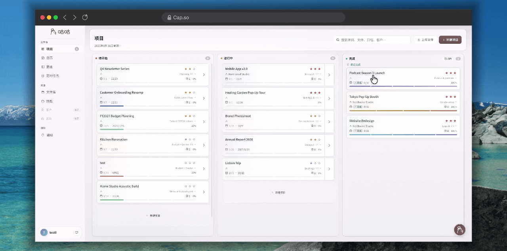
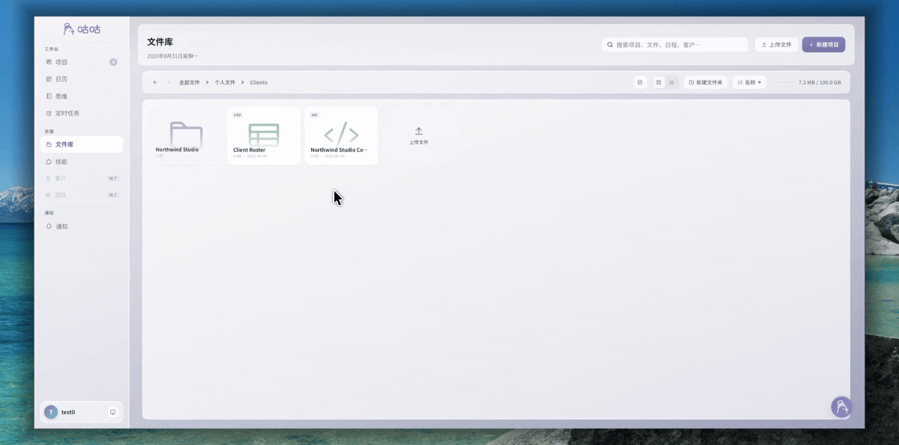
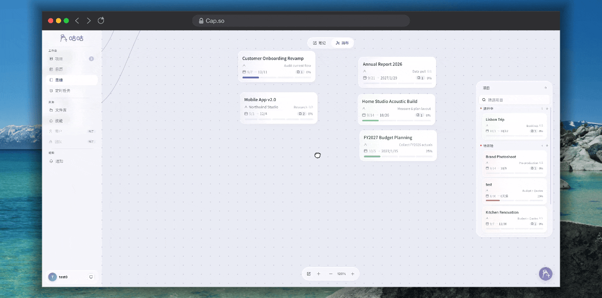

<div align="center">


# Gugu Interaction Runtime

<p><a href="./README.md">中文</a></p>

<p>
  <a href="./LICENSE"></a>
  
  
  
</p>

<p>
  <a href="./docs/API.md">API Reference</a> ·
  <a href="./docs/INTEGRATION.md">Integration Guide</a> ·
  <a href="./docs/integration/VUE.md">Vue Integration</a> ·
  <a href="./docs/DESIGN.md">Design Notes</a>
</p>

<p><em>A framework-agnostic interaction runtime for kanban boards, file managers, and canvases.</em></p>

<p>Let the Runtime handle dragging, layout coordination, landing handoff, and node connections. Your application only needs to declare objects and surfaces, then consume semantic Actions.</p>

<p>This is a Vibe Coding project. Issues, suggestions, and Pull Requests are welcome.</p>

</div>

## Use Cases

<table>
  <tr>
    <td width="50%" valign="top">
      
      <h3>Kanban Board</h3>
      <p>Cross-column movement, same-column sorting, grouped layouts, and FLIP animations for project boards, task flows, and status columns.</p>
    </td>
    <td width="50%" valign="top">
      
      <h3>File Manager</h3>
      <p>Folder targets, breadcrumbs, multi-selection, and grid/list layouts for file trees and resource managers.</p>
    </td>
  </tr>
  <tr>
    <td width="50%" valign="top">
      
      <h3>Freeform Canvas</h3>
      <p>Canvas zooming and free-coordinate landing for whiteboards, flowcharts, and freeform layout editors.</p>
    </td>
    <td width="50%" valign="top">
      
      <h3>Cross-Container Dragging</h3>
      <p>Move objects between a canvas and a floating drawer while keeping proxy, landing, and layout handoff continuous.</p>
    </td>
  </tr>
</table>

## Core Capabilities

| Scenario | Capabilities |
| --- | --- |
| Kanban | Cross-column movement, same-column sorting, group expand/collapse, relative FLIP |
| File manager | Folder and breadcrumb targets, multi-selection dragging, grid/list layouts |
| Canvas | Free-coordinate landing, camera zoom, floating surfaces, node-port connections |
| General | Proxy, landing, regrab, Actions, MotionController, VisualAdapter |
| Frameworks | Framework-agnostic Core, Vue composables, Vue/React DOM adapters |

## Installation

```bash
npm install gugu-interaction-runtime
```

The Runtime does not bundle Vue or React. When using the Vue entry point, install Vue 3 in your application. React and other frameworks can use the Core API or the DOM adapter directly.

## 30-Second Integration

Basic integration takes three steps: register an object, register its surface, and listen for Actions.

```ts
import { runtime } from 'gugu-interaction-runtime'

runtime.registerObjectType('project-card', {
  defaultVisualMode: 'detach',
})

runtime.objects.register({
  id: 'project:123',
  type: 'project-card',
  surfaceId: 'column:active',
  element: cardElement,
  abilities: ['move', 'sort'],
})

runtime.surfaces.register({
  id: 'column:active',
  type: 'project-column',
  element: columnElement,
  accepts: ['project-card'],
  layout: 'grid',
})

const stop = runtime.onAction(action => {
  if (action.type === 'move' || action.type === 'sort') {
    projectStore.applyInteraction(action)
  }
})
```

The application owns Actions and Store updates. The Runtime owns hit testing, proxies, pointer following, landing, FLIP, regrab, and cleanup.

## Basic Concepts

```text
Object     An item that can be grabbed, sorted, moved, or connected
Surface    A list, folder, canvas, or other layout area containing objects
Target     A semantic drop target without an Object identity
Session    The lifecycle of one interaction
Action     The interaction result emitted to the application Store
```

The Runtime does not own projects, files, permissions, or backend APIs. It only provides interaction execution and visual lifecycle management.

## Vue Integration

Vue projects should use the dedicated entry point. The composables handle DOM refs, reactive field updates, component unmounting, and generation protection:

```ts
import {
  provideRuntime,
  useObject,
  useSurface,
  useTarget,
  useRuntimeAction,
} from 'gugu-interaction-runtime/vue'
import { runtime } from 'gugu-interaction-runtime'

provideRuntime(runtime)

const { elementRef } = useObject({
  id: 'project:123',
  type: 'project-card',
  surface: 'column:active',
  abilities: ['move', 'sort'],
})

useRuntimeAction(action => projectStore.applyInteraction(action))
```

Bind `elementRef` to the real object element in the template. Floating drawers and other complex areas can use:

```ts
useSurface({
  id: 'project:drawer',
  type: 'project-drawer',
  accepts: ['project-card'],
  layout: 'grid',
  floating: true,
})
```

## React and Native DOM

React and other frameworks can use the same Core registries or use the DOM adapter to manage callback refs:

```ts
import { createReactRuntimeAdapter, runtime } from 'gugu-interaction-runtime'

const dom = createReactRuntimeAdapter(runtime)
dom.bindObject('project:123', cardElement)
dom.bindSurface('column:active', columnElement)
```

The adapter only manages DOM lifecycle and layout mutations. It does not register business semantics or submit Actions.

## Common Patterns

### Kanban Board

Register `project-card` Objects and `project-column` Surfaces with a `grid` layout. The Runtime emits `move`, `move-group`, or `sort` Actions; the application only needs to map the result to its project Store.

### File Manager

A folder card can be registered as both an Object and a Target. A breadcrumb without an Object identity can be registered as a Target on its own. The Runtime does not need to understand `fileId` or `folderId`; file permissions, move APIs, and failure rollback remain in the application.

### Canvas

Use `layout: 'free'`, provide zoom and origin through `Surface.camera`, and provide free-position landing through `resolveFreeLandingRect`. Node connections use `node.ports` on Objects. The Runtime handles port geometry, hit testing, deduplication, and connection lifecycle; the application owns relationship data and rendering.

### Multi-Selection Dragging

Set `selected` on Objects. Grabbing a selected primary object automatically creates a Group Session and emits a `move-group` Action. The Runtime provides stacked group visuals by default, and `groupVisual` can override them.

## Visual and Motion Customization

The default visual strategy is `detach`, with a built-in MotionController. Common configuration includes:

```ts
runtime.registerObjectType('file-item', {
  defaultVisualMode: 'detach',
  grabAlign: { align: 'pointer' },
  releaseMode: 'physical',
  proxyLayout: {
    compact: {
      selector: '[data-view="list"]',
      width: 'min(320px, calc(100vw - 48px))',
    },
  },
})

runtime.configureMotion({
  flip: { duration: 220, easing: 'cubic-bezier(.22,1,.36,1)' },
  resize: { duration: 220, easing: 'cubic-bezier(.22,1,.36,1)' },
  landing: { duration: 220, easing: 'cubic-bezier(.22,1,.36,1)' },
  group: { duration: 220, easing: 'cubic-bezier(.22,1,.36,1)' },
})
```

For custom proxy or state visuals, implement `VisualAdapter`. The application owns colors, shadows, border radii, and content structure; the Runtime owns state handoff between the proxy and the real node.

## Action Types

The Runtime emits a discriminated union through `runtime.onAction()`:

| Action | Purpose |
| --- | --- |
| `move` | Move one Object to another Surface |
| `move-group` | Move multiple Objects together |
| `transfer` | Transfer between areas without a sort position |
| `sort` | Reorder within the same Surface |
| `connection-create` | Create a connection between two Node ports |
| `connection-delete` | Delete a registered connection |
| `connection-cancel` | Cancel a connection interaction |

## Design Boundaries

- The Runtime does not modify the application Store or own backend APIs, permissions, or failure rollback.
- The application should not control the same node's `transform`, `height`, or `transition` at the same time as the Runtime.
- Proxies are created and cleaned up by the Runtime. The application should not add duplicate pointer listeners or create a second proxy.
- After a cross-surface move, the real Object may be a new DOM node. Local node state should live in application data.
- Do not import from deep `src/` paths. Use the package root or the `/vue` subpath.

## Documentation

- [Core API Reference](docs/API.md)
- [Integration Guide](docs/INTEGRATION.md)
- [Vue Integration Guide](docs/integration/VUE.md)
- [Visual Strategies](docs/VISUAL_STRATEGIES.md)
- [Design Goals](docs/DESIGN.md)

## Local Development and Verification

```bash
npm install
npm run dev
npm run typecheck
npm test
npm run build:lib
```

## License

[MIT](LICENSE)

## Contact

- Email: `coffeiz216@gmail.com`
